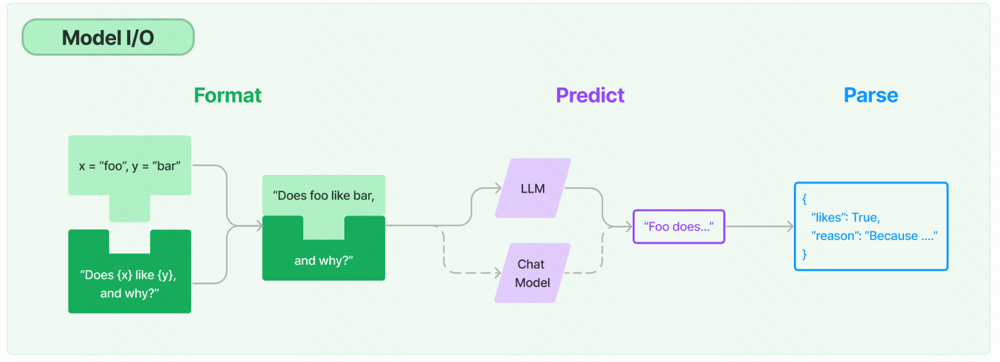

### 一、模型models



#### 1.prompt

##### 1.1提示模板

- 将用户输入与模板进行格式化交给模型

##### 1.2示例选择器——few-shot

- 将提示的示例内容同样拼接到语句中，让模型去理解语义含义进而给出结果。

  ```python
  example_prompt = PromptTemplate(
      input_variables=["input", "output"],
      template="示例输入:{input}, 示例输出:{output}",
  )
  # 这是可供选择的示例列表
  examples = [
      {"input": "飞行员", "output": "飞机"},
      {"input": "驾驶员", "output": "汽车"},
      {"input": "厨师", "output": "厨房"},
      {"input": "空姐", "output": "飞机"},
  ]
  
  value = "学生"
  # 模版生成内容
  final_prompt = similar_prompt.format(value=value)
  ```

  

##### 1.3输出解析器

- 作用：获得比文本更**结构化**的信息(JSON)

#### 2.模型

- chat、LLMS、embedding

### 二、链chains

- 将一系列模块化组件（或其他链）以特定方式组合起来，以实现共同的用例
- 结果审查、数学问题、网页请求、数据库查询等功能
- 种类：异步链、顺序链、LLM链等

### 三、检索retrieval


- 根据文档创建索引，进而创建检索器，实现根据文档内容回答问题
- 索引创建过程：
  - 将文档(长文本)分割成块——将语义相关的文本片段保持在一起
  - 将每个文档进行embedding
  - 在向量库中存储文档和embedding

### 四、记忆化memory

在对话过程中存储和检索数据的概念。主要有两种方法：

1. 根据输入，获取任何相关的数据。
2. 根据输入和输出，相应地更新状态。

可以向chain、agent记录。

### 五、代理

- 代理使用LLM来确定采取哪些行动以及顺序。 一个动作可以是使用工具并观察其输出，或返回给用户。

#### 1.工具

- 执行特定职责的函数。这可以是诸如：Google搜索、数据库查找、Python REPL、其他链等。

### 六、使用过程总结

1. 加载知识库
2. 对知识库内容进行embedding，存入向量库
3. 构造prompt并使用chain连接上model或其他链
4. 利用其他API工具形成代理