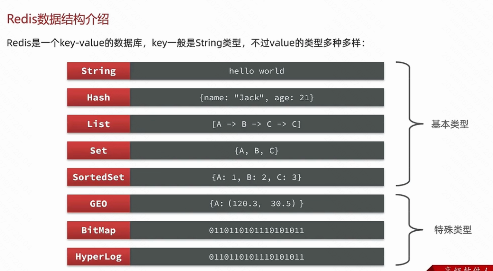
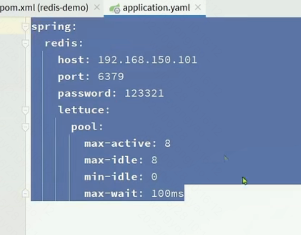

### 数据结构

### 通用命令

### String类型

- string：普通字符串
- int: 整数类型，可以自增自减
- Float: 浮点，可以自增自减

### key的层级结构

### Hash类型

### List类型

### Set类型

### SortedSet

### Jedis

### SpringData

- 配置yaml

- 注入redisTemplate

  

- 存入时会将数据序列化——可读性差、内存占用大

  - 使用jackson或spring

    

  - 但是会存类的字节码名称来反序列化，占用空间

    

### 短信登录

> 服务器处理要响应 IO 事件外，还要处理其它事情。比如定时任务就是非常重要的一件 事。如果线程阻塞在 select 系统调用上，定时任务将无法得到准时调度。那 Redis 是如何解 决这个问题的呢?

select不是用一个单独的线程selector去轮询调用的吗。而且redis不是单线程吗0.0

主从节点读写分离时，数据不一致问题