## Trajectory Clustering via Deep Representation Learning

### 一、摘要

传统的轨迹聚类方法通常使用的相似性度量方式不考虑轨迹数据在不同空间区域和时间段的变化，因此这些方法难以有效地将具有相似运动模式的轨迹聚集在一起。在实际情况下，一些轨迹数据可能在**不同的地理区域和时间段内表现出相似的运动模式**，但传统方法无法捕捉这种特性，因为它们的相似性度量方法不具备空间和时间不变性，无法适应这种情况。

该论文提出的方法旨在通过学习轨迹数据的低维表示，使得这些表示具有空间和时间不变性，从而能够更好地检测轨迹数据中的运动模式，无论这些模式出现在不同的空间区域和时间段。这种方法的目标是提高轨迹聚类的效果，使其更适用于现实世界中的轨迹数据分析。

### 二、贡献

1. 能够将不同区域中以不同长度、采样频率得到的轨迹分组

2. 由于数据质量、采样频率不同，并且连续记录之间存在噪音，直接使用RNN存在问题。使用滑动窗口提取运动特征，并使用auto-encoder学习轨迹固定长度的特征

   

### 三、网络框架

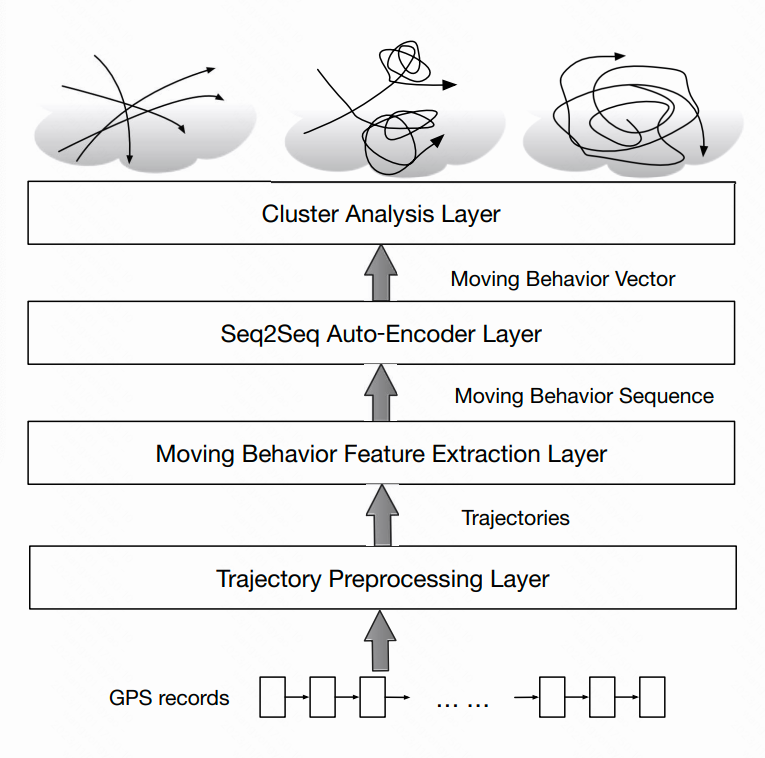

- **Trajectory Preprocessing Layer**：该层的输入是移动物体的GPS记录序列。序列是有噪声的，并且一些记录对之间的时间间隔可能非常大。在这一层中，我们去除了低质量的GPS记录，并将序列切割成具有时间连续性的轨迹。
- **Moving Behavior Feature Extraction Layer**：使用运动行为特征提取算法对所有轨迹进行处理。基于滑动窗口，将轨迹转换为特征序列
- **Seq2Seq Auto-Encoder Layer**：使用auto-encoder将每个特征序列embedding到固定长度的向量中。该向量对轨迹的运动模式进行编码
- **Cluster Analysis Layer**：使用聚类算法，将表征向量转换为聚类。

### 四、方法细节

#### 1.特征提取层

- 窗口长度$L_p$，偏移量$offset_p= \frac{1}{2}L_p$.
- 对于每个窗口$W$,有$R$条记录，如果$R\ge1$，窗口内的记录两两之间计算$\Delta t,\Delta l,\Delta s,\Delta r$
- 进一步可以计算feature，$f_i=(f_{\Delta l_i},f_{\Delta s_i},f_{\Delta r_i})$，其中$f_{\Delta l_i}=\Delta l_i/\Delta t_i$表示平均速度，$f_{\Delta s_i}=\Delta s_i$表示速度变化量，$f_{\Delta r_i}=\Delta r_i$表示ROT变化量。
- 由此每个窗口可以得到一组特征$f=\{f_1,f_2,\dots,f_R\}$，$f_i$中三个维度每个维度取**平均值、最大值、75%分位点，50%分位点，25%分位点，最小值**这六个统计量，最终每个窗口可以得到$3x6=18$维的特征。
- 将每个窗口的特征组成集合$B_{TR}$，每个$B_{TR}$组成$BS$并进行标准化，准备传输给auto-encoder层

#### 2.Auto-Encoder层

## Unsupervised Path Representation Learning with Curriculum Negative Sampling

### 1. curriculum learning

通用的课程学习框架为Difficulty Measurer （困难程度评估）+ Training Scheduler（训练计划） 两部分

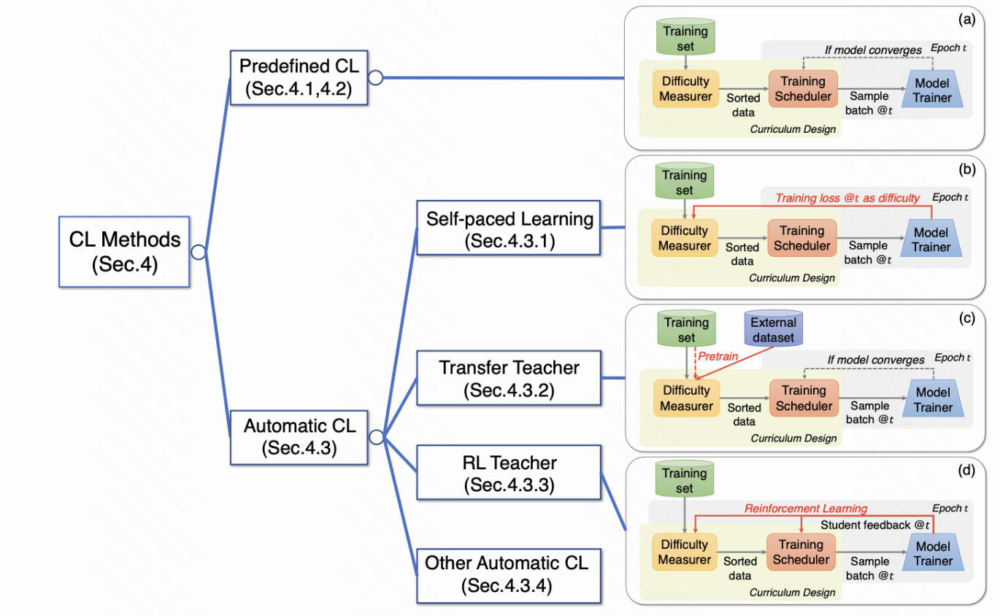

#### 1.1 预定义CL

- 在预定义的CL中，需要开发者手动评估样本学习的困难程度，然后根据困难程度将样本排序后进行训练

##### 1.1.1 预定义Training Scheduler

- 离散类型
  - 离散的情况下模型会在收敛于某个数据子集或在数据子集上训练固定数量的epoch后调整训练数据子集
- 连续类型
  - 连续的情况下，模型会在每个epoch后调整训练数据子集

#### 1.2 自动化CL

- 自主学习：SPL通常采用模型每个样本训练的loss作为衡量该样本学习困难程度的标准。
- Transfer Teacher：引入额外的数据集，训练一个Teacher模型。迁移已经训练好的模型来评估的样本的困难程度，可以避免未充分训练的模型评估时的风险
- RL Teacher：包含了学生模型和基于强化学习的老师模型，在每一个epoch的训练策略中，RL teacher会根据学生反馈动态选择训练数据。数据选择作为RL的action，学生反馈作为state和reward。

### 2.背景

- 现有的PRL研究通常以有监督的方式学习路径表示
  - 首先，它们需要大量标记的训练数据。
  - 其次，学习到的路径表示是特定于任务的，例如，对于带有标签的任务来说效果很好，但对其他任务的泛化能力较差。

### 3.方法

- 课程负抽样方法
  - 为输入路径生成少量负路径。
    - 该策略没有随机选择其他输入路径作为负路径
    - 首先生成与输入路径有很大不同的路径，因此很容易与输入路径区分开来。
    - 然后，逐渐生成与输入路径越来越相似的路径，因此更难与输入路径区分开来。

- 路径表示学习方法——互信息最大化
  - 全局视图——路径-路径区分器
    - 捕获输入路径与其负路径之间的表征差异
  - 局部视图——路径-节点区分器
    - 捕获输入路径与仅出现在其负路径中的节点之间的表征差异

### 4.模型

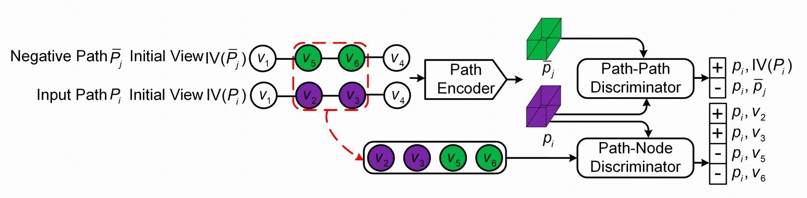

- 路径编码器PE
  - 输入：路径$P_i$的初始视图$IV(P_i)$
    - 即每个节点的表征向量
  - 输出：$P_i$的表征向量$p_i$
- 课程负采样
  - 策略：
    - 完全不同的随机路径
    - 首尾相同
    - 中间节点逐渐重合

- 路径-路径分辨器——判断是否来自同一路径

  - 输入：一对路径表征$(p_i,\overline p_j)$

  - 正对：$(p_i,IV(P_i))$

  - 负对：$(p_i,\overline p_j)$

  - 目标函数

    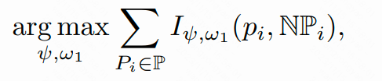

    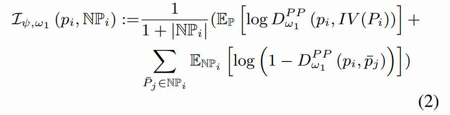

    - $P_i$是路径集$\mathbb{P}$中的一条路径
    - $\mathbb{NP}_i$是$P_i$的负路径集
    - $\mathbb{E}$是期望

- 路径-节点分辨器

  - 输入：一对(输入路径表征，节点特征向量)，如$(p_i,\{V_2,V_3,V_5,V_6\})$

  - 正对：仅出现在$p_i$的节点向量，$(p_i,V_2)$

  - 负对：仅出现在负路径的节点向量，$(p_i,V_6)$

  - 目标函数

    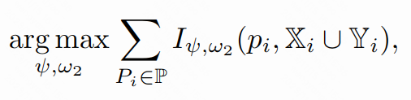

    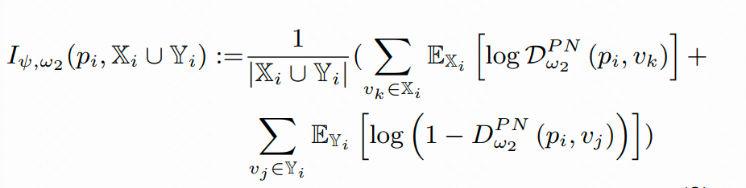

    - $\mathbb X$是只出现在输入路径而不出现在负路径中的点的点集，$\mathbb Y$相反

- 最终目标函数

  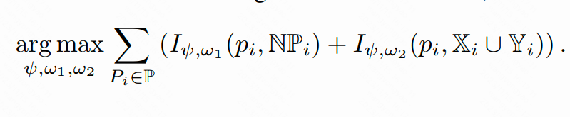

### 5.下游任务

- TTE：旅行时间估计
- Path Ranking：给定OD，给出一系列相关路径的分数

## Robust Road Network Representation Learning: When Traffic Patterns Meet Traveling Semantics

### 1.背景

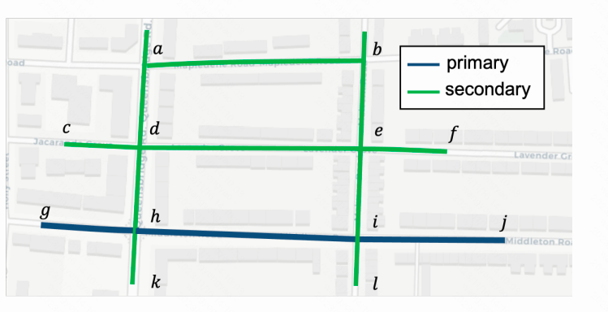

- **关于常见图和路网之间特定假设的差异**
  - 现有研究在图上的假设在路网中不成立。例如，引用图通常表现出网络同质性，这意味着**互连节点比远程节点**更相似。然而，**空间相邻路段可能不一定在路网上显示类似的交通模式**。在Figure 1中，路段$dh,gh,hi,hk$是相互连接的，但是主路和辅路通常有不同的交通模式，例如车流量，因为主路行驶更频繁。

- **特征一致性问题**。**路网上的特征，如道路类型和车道数，通常在空间上接近的节点之间共享**。
  - 由于城市对不同的分区（如商业区和住宅区）表现出不同的功能，路网的某些部分通常具有相同的特征。

### 2.方法

- 扩展skip-gram模型，通过加入辅助交通上下文预测目标，实现交通模式的模型感知。
  - **不仅能够用原始的skip-gram目标编码路网的图结构，还能够根据交通模式区分路段**，从而解决第一个差异问题
- 利用**轨迹数据**来提取特征一致性导致的路网不可区分部分的行驶语义。
  - 使用堆积的双向Transformer架构将轨迹数据中体现的转移模式捕获到表示中
    - 两个新的训练任务：路径恢复和轨迹识别
- **这两个模块都基于自监督的训练范式，其中交通模式和旅行语义被直接视为训练目标，而无需进一步的特定任务标记信息**。

### 3.模型

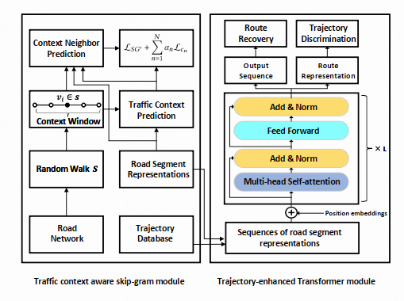

#### 3.1 Skip-gram Model

- 将图中的节点视为一个**单词**，图上的随机游走$S$视为一个句子。

- 最大化在给定目标节点的上下文窗口内观察邻域节点的可能性，等于最小化以下损失函数

  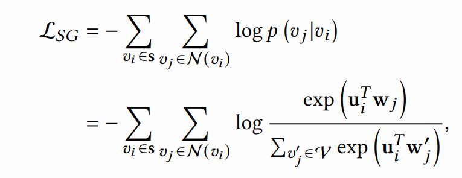

  - $N(v_i)$指$v_i$的上下文邻居集合。
  - $u_i$是$v_i$的embedding

#### 3.2 辅助交通上下文预测任务

- 为了将交通模式融入表征，作者通过引入辅助交通上下文预测任务扩展skip-gram模型。

  - 如限速、道路类型

- 对选定的特征进行二值化

  - 假设从交通上下文特征集$\{c_n\}_{n=1,2,\cdots ,N}$中选择道路类型$c_n$作为特定特征，它有$|c_n|$种选项，于是被处理为$|c_n|$维标签向量，其中每个维度是0或1，表示目标路段的一个特定选项的存在。

- 给定目标路段$v_i$及其N类交通上下文特征$\mathbf{\pi}(v_i)=\{c_n^i\}_{n=1,2,\cdots,N}$,最小化以下损失函数

  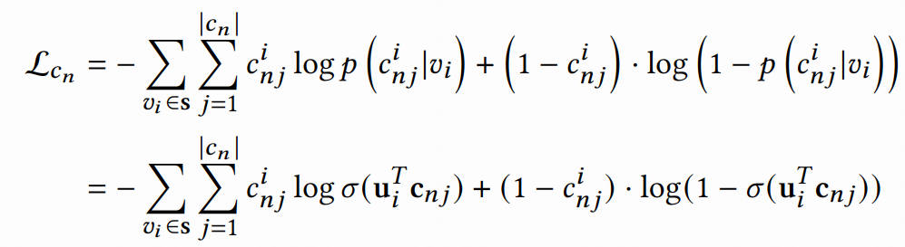

  - $c^i_{nj}$是路段（节点）$v_i$的第$n$个特征$c_n$的第$j$项
  - $\mathbf{u}_i$是$v_i$的embedding
  - $\mathbf{c}_{nj}$是$c_{nj}$的embedding

- 由此，作者将skip-gram的目标修改为

  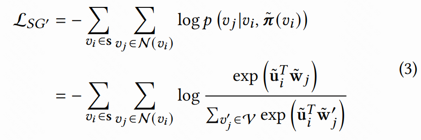

  - $\mathbf{\tilde  \pi }(v_i)=\{\tilde c_n^i\}_{n=1,2,\cdots,N}$，$\tilde c_n^i=[\sigma(\mathbf{u}_i^T\mathbf{c}_{nj})]^{|c_n|}_{j=1}$是路段$v_i$的第$n$个预测的上下文
  - $\mathbf{\tilde u}_i$是$v_i$的增强交通嵌入，是原始嵌入$\mathbf{u}_i$和所有交通上下文预测$\mathbf{\tilde  \pi }(v_i)$的concatenation
  - $\mathbf{\tilde w}_j$是节点$v_j$的上下文嵌入

- 最终损失函数是

  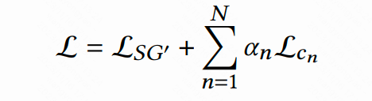

  - $\alpha_n$是控制辅助任务权重的超参数

#### 3.3 双向自注意网络

- Input Embedding Layer
  - 由于自注意网络并行处理输入token，会导致丢失轨迹的顺序信息，因此这里再加入一个可学习的**位置嵌入**
    - $\mathbf{x_i}=\mathbf{u_i}+\mathbf{p_i}$
    - $\mathbf{u_i}$是路段嵌入，$\mathbf{p_i}$是位置嵌入

- 多头自注意力层

- 残差连接+层标准化

- 全连接

#### 3.4 训练——预训练任务

##### 3.4.1 路线恢复

- 屏蔽连续路段。如果随机屏蔽每个路段，skip-gram可能很好地学习到图结构，从而轻易判断出轨迹中某个路段的下一个路段，这就导致MLM无法学到有用的东西。因此采用屏蔽连续路段的方式训练。

##### 3.4.2 轨迹判断

- 判断给定的轨迹是否是真实的轨迹。真实的行程是从轨迹数据库中采样的，而虚假的行程是通过在道路网络上采样的随机行走生成的。
  - 捕获转移模式。通过观察某些子序列不遵循正常的转移模式来识别假行程

### 4.下游任务

- 路段任务

  - 道路标签分类

  - 交通推断

- 轨迹任务

  - 轨迹相似性搜索
  - 行程时间估计

## Self-supervised Trajectory Representation Learning with Temporal Regularities and Travel Semantics

### 1.背景

- 早期的TRL将轨迹视为普通序列数据，不能完全捕捉轨迹的时空语义信息
- 现有的两阶段方法
  - 只对静态道路图进行建模，没有结合旅行语义，如路段间的转移概率
  - 将轨迹视为位置序列，没有考虑时间信息
  - 预训练任务重没有考虑轨迹的时空特征
    - 序列重建
    - MLM

### 2.方法

- 采用两阶段学习方法
  - 轨迹模式增强图注意力网络
    - 以道路特征作为输入
    - 使用路段转移概率矩阵来建模道路访问频率
    - 这样道路特征的旅行语义和访问频率都会被融入到道路表征中
  - 将道路表征序列转换为轨迹表征
    - 结合时间规则性信息

### 3.模型

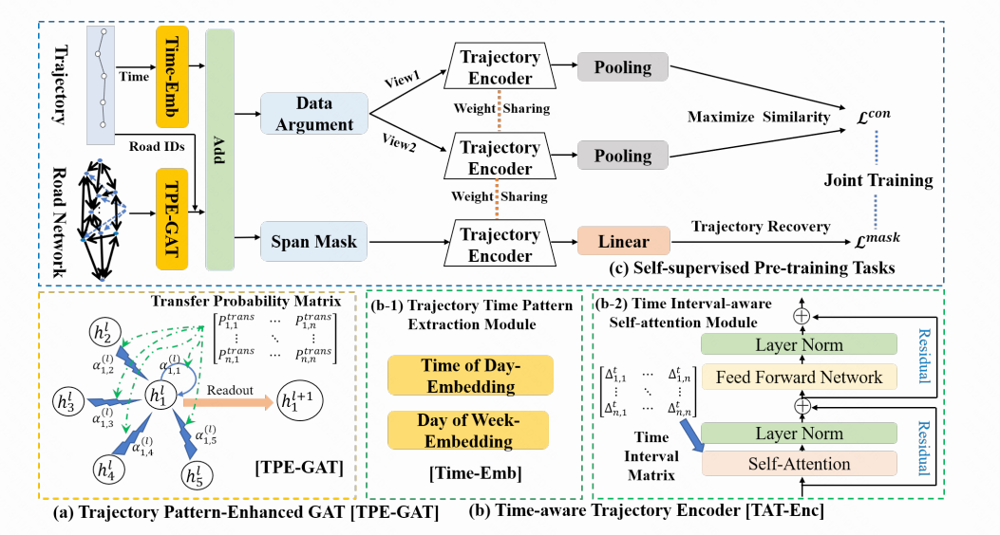

#### 3.1 轨迹模式增强的图注意层 TPE-GAT

- **功能**：将路网转换为融合轨迹旅行语义的表征向量
- 轨迹受到道路网络连通性的约束，因此需要从**道路特征和网络结构**来学习道路表征向量。
- 标准的GAT无法捕捉轨迹中的旅行模式
  - 引入路段之间的概率转移矩阵来模拟路段访问频率，扩展了GAT的注意力权重计算

- 输入

  - 路段特征$\mathbf{F}_{\mathcal{V}}$
    - 道路类型、道路长度、车道数、限速、入度、出度
    - 做cat操作作为路段的初始表征向量

- 第$l$层路段$v_i$和$v_j$的注意力权重$\alpha_{ij}$计算

  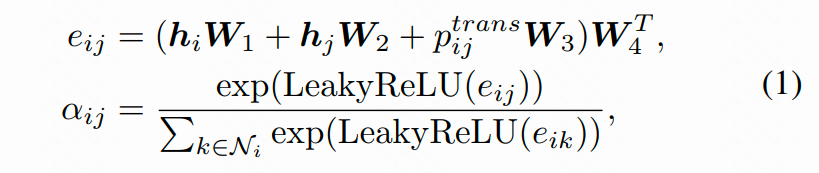

  - $h_i$和$h_j$分别表示路段$v_i,v_j$的表征向量
  - $p_{ij}^{trans}$是$v_i$到$v_j$的转移概率
    - 通过历史数据由统计公式计算得到——**可不可以用深度模型预测，而且也没有结合时间**

- 输出：路段特征向量$\mathbf{r}_i$

  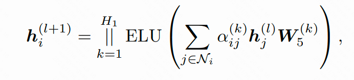

  - $H_1$是注意力神经元数量，即"头"
  - $||$是cat操作

#### 3.2 时间感知轨迹编码层

- **功能**：结合时间规律信息，将路段表征序列转变为轨迹表征

##### 3.2.1 轨迹时间模式抽取模块

- 将路段$v_i$的每个时间戳$t_i$嵌入为$\mathbf{t}_{mi(t_i)}$和$\mathbf{t}_{di(t_i)}$

  - 其中$mi(t_i)$和$di(t_i)$分别是将$t_i$转换为***分钟***序号(1-1440)和***天***序号(1-7)的函数

- 得到$v_i$的最终embedding

  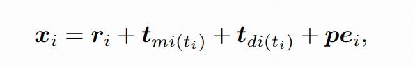

  - $\mathbf{r}_i$：路段特征向量
  - $\mathbf{pe}_i$：$v_i$在轨迹的位置编码

- 输出：轨迹的初始表征向量——通过concat所有经过路段的$\mathbf{x}_i$

##### 3.2.2 时间间隔感知的自注意模块

- 路段之间的不规则时间间隔，可以反映道路的拥堵程度

  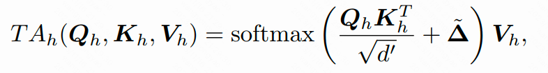

  - $\tilde \Delta$是一个自适应的时间间隔矩阵，衡量轨迹路段间的影响
  - 当$v_i$和$v_j$之间的时间间隔较短时，$\delta_{ij} \in \tilde \Delta$有较大值，即这两条路在自注意中具有较强的影响 ？？？

- $\delta_{ij}$的计算方法

  - $\delta_{i,j}=|t_i-t_j|$

  - 为了让影响随着时间间隔的增加而变小，引入衰减函数

    - $\delta_{i,j}'=1/log(e+\delta_{i,j})$

  - 加入可学习参数

    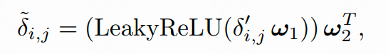

### 4.预训练任务

- 连续掩码预测

  - 同上一篇

  - 用$[MASK]$替换$v_i$，$[MASKT]$替换时间索引

  - 获得轨迹的预测向量后，经过一个全连接层预测遮盖的道路

  - 使用交叉熵作为loss

    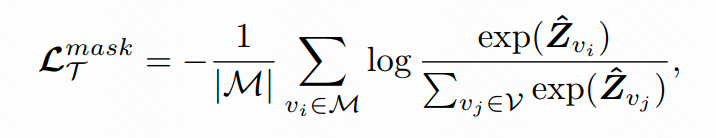

- 轨迹对比学习

  - 掩码预测侧重于捕捉道路上下文信息，还需要训练时空特征和旅行语义
  - 数据增强策略
    - 轨迹剪裁——在起点和终点进行裁剪(不破坏轨迹连续性和行进语义)——真的可以不破坏吗？
    - 时间扰动
    - mask
    - Dropout——在嵌入层随机去掉一些特征（还是作为正样本）

### 5.下游任务

- 出行时间预测——全连接
- 轨迹分类——全连接+softmax
- 轨迹相似度计算和搜索
